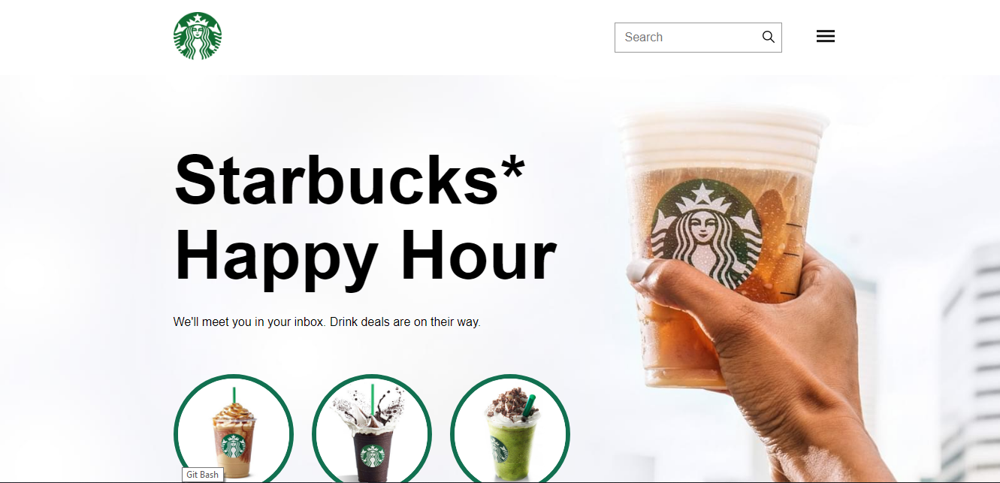
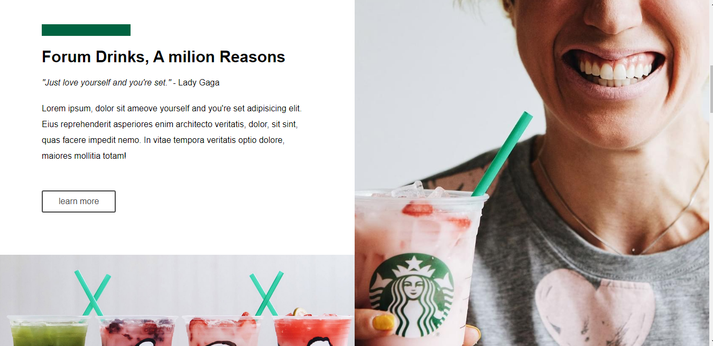

### Sobre o Projeto:

Este é um projeto desenvolvido durante o módulo de HTML/CSS do curso oferecido pela B7web, com o objetivo de evoluir a construção individual do aluno. O tema escolhido foi "Starbucks", e a página web foi criada totalmente sozinha, utilizando apenas HTML5 e CSS3,com o uso esclusivamente do CSS-grid. Além disso a também está totalmente responsivo para tablets e celulares, no site a links de redes sociais e um link com o endereço.
 
### Tecnologias utilizadas:

    <ul>
        <li>HTML</li>
        <li>CSS</li>
    </ul>

### Pré-visualização :

